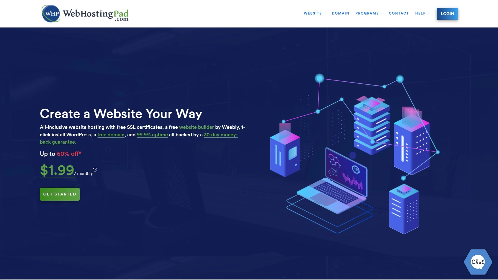
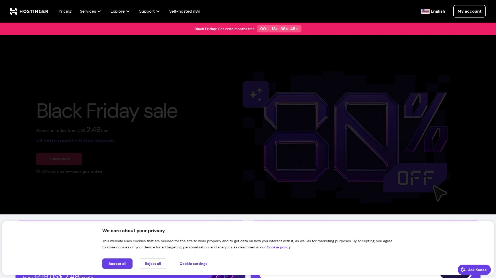
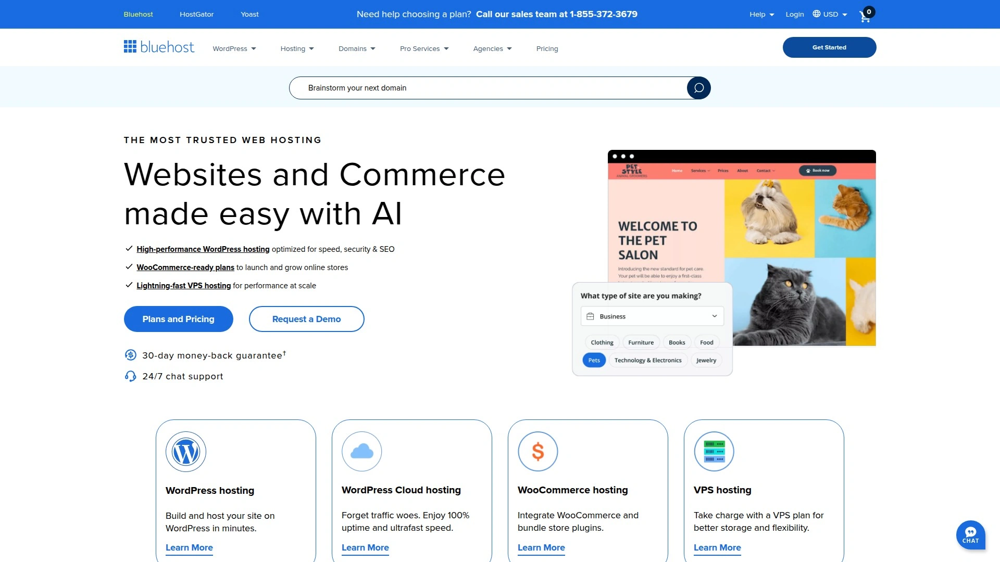
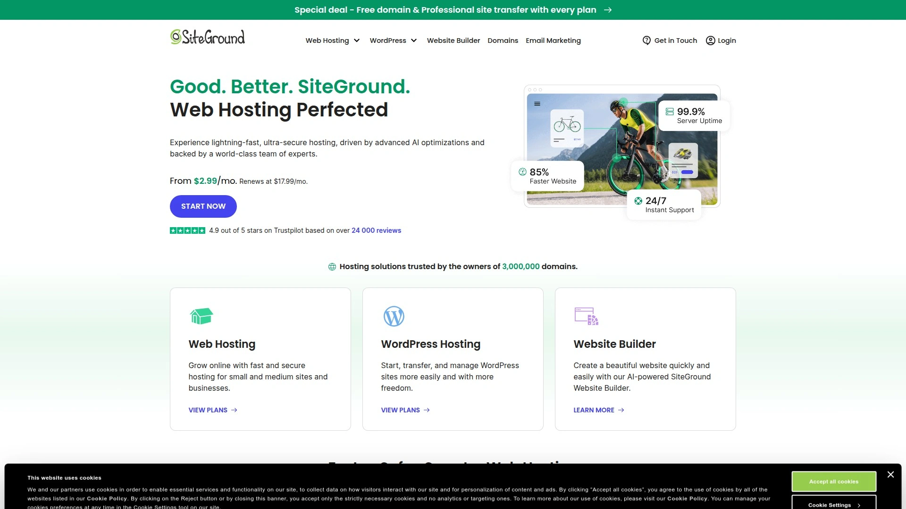
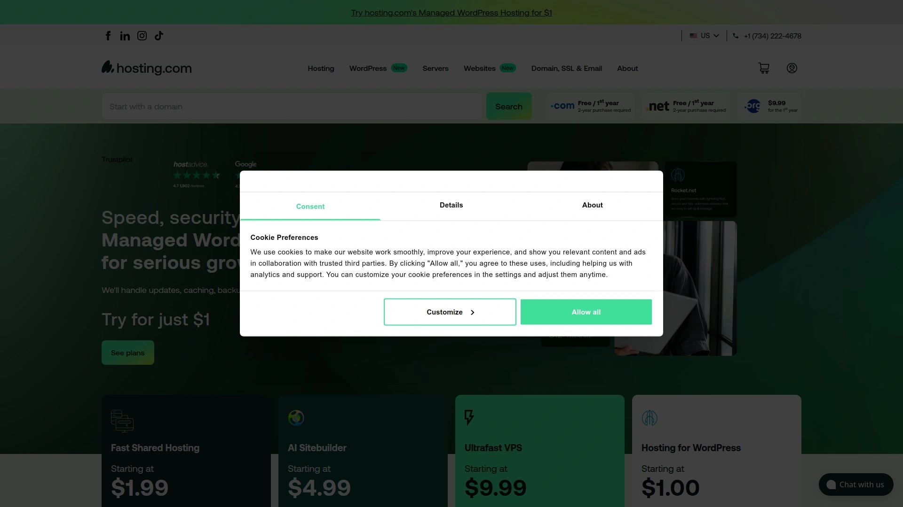
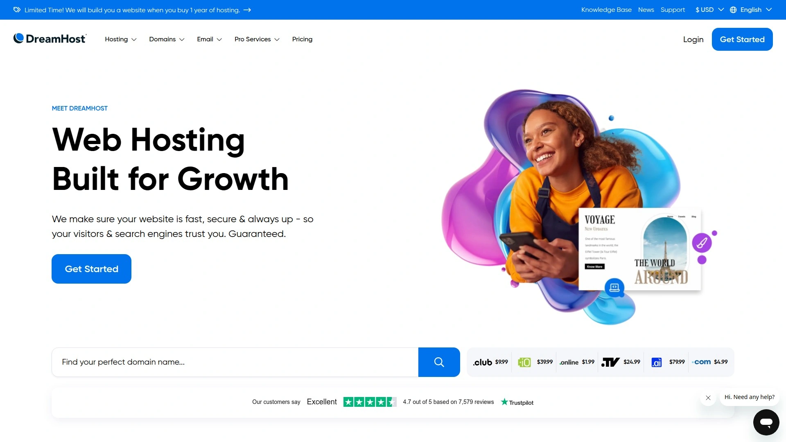
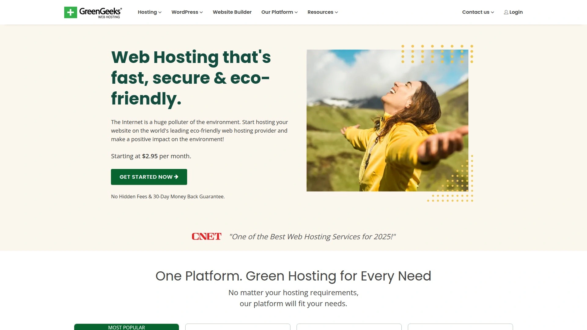
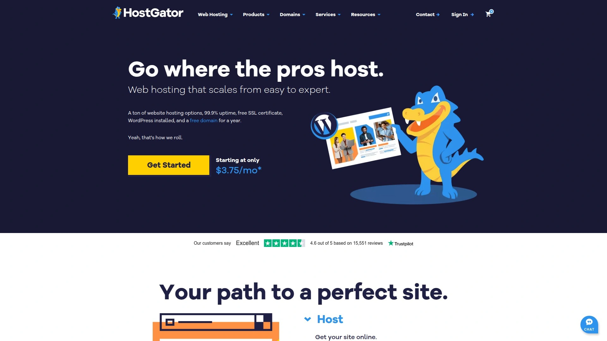
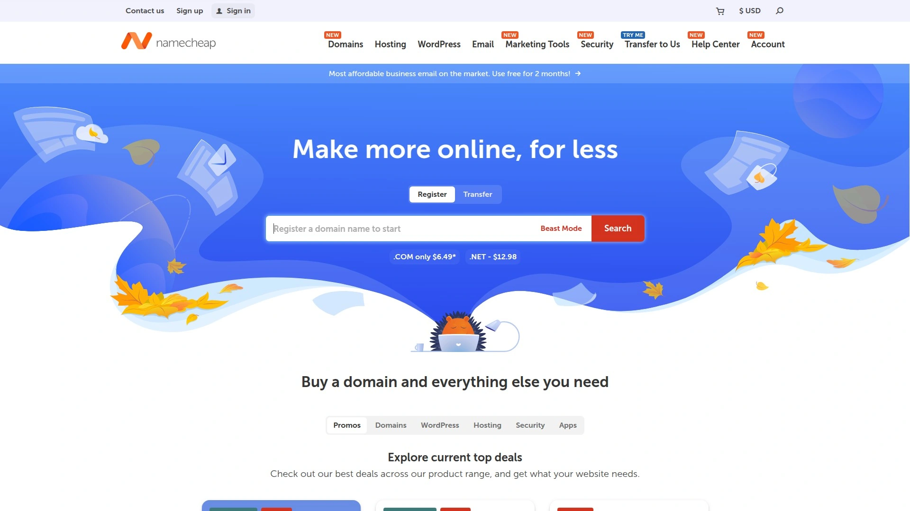
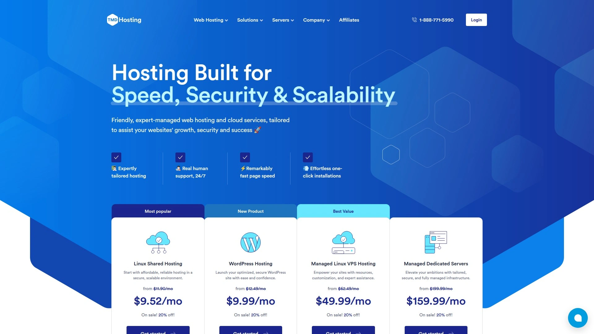

# Latest Budget Web Hosting Curated List (Including Feature Comparison)

Launching a website shouldn't cost more than your domain name idea, yet traditional hosting companies still charge $20-40 monthly for basic shared hosting that barely handles 10,000 visitors. Budget web hosting services flip that model by offering reliable servers, cPanel access, and essential features for under $5 monthly, letting startups and small businesses save hundreds annually without sacrificing uptime or performance. Whether you're launching a personal blog, small business site, or testing a new project, these 12 platforms deliver solid infrastructure at prices that won't drain your bootstrapped budget.

***

## **[WebHostingPad](https://webhostingpad.com)**

The ultra-affordable starter with cPanel and military-grade security.

WebHostingPad carved out its niche by offering genuinely cheap hosting that doesn't completely sacrifice essential features. Plans start under $2 monthly with introductory pricing that remains affordable even after renewal. The platform includes industry-standard cPanel control panel, which matters more than you'd think—many budget hosts force you onto proprietary dashboards that complicate migrations and limit flexibility. One-click WordPress installation through Softaculous makes launching sites straightforward even without technical knowledge.

Security features included at base pricing levels separate WebHostingPad from competitors charging extra for basic protections. Automated malware scanning, quarantine systems, and removal tools come standard with WordPress plans. Free SSL certificates through Let's Encrypt encrypt traffic between visitors and your site. The 30-day money-back guarantee covers hosting purchases, giving you a full month to test performance before committing long-term. SSH access on higher-tier plans enables secure server connections for developers needing command-line control.

Average load speeds hover around 786 milliseconds, which sits in acceptable territory for budget hosting. Uptime averaged 99.89% over testing periods with approximately five hours of downtime across six months. These numbers won't impress performance enthusiasts but work fine for starter sites handling moderate traffic. Unmetered bandwidth removes worries about traffic caps, though shared hosting limitations still apply. Storage starts reasonable and scales with plan upgrades.

Customer support operates through live chat, phone, ticketing systems, and an extensive knowledge base. Response times typically run under one minute during business hours, with representatives providing helpful guidance rather than scripted deflections. Support quality drops during off-hours and becomes nearly impossible to reach during server issues, so don't expect enterprise-level availability. The beginner-friendly client area uses logical layouts for managing services, domains, security, and billing. For budget-conscious users needing basic hosting with essential features included, WebHostingPad delivers functional service at genuinely low prices.

***

## **[Hostinger](https://hostinger.com)**

The speed champion with 25 sites, 100GB storage, and perfect uptime.

Hostinger dominates the budget hosting category by combining genuinely low pricing with performance metrics that rival premium hosts. Plans start at $2.24 monthly with introductory pricing, supporting up to 25 websites with 25GB storage. That multi-site capability matters significantly—most budget hosts limit you to one domain, but Hostinger lets you run two dozen projects from a single account. Free domain registration for the first year saves another $15 annually. Recent testing showed 100% uptime for three consecutive months alongside impressive load speeds averaging under 2 seconds globally.

The platform's custom hPanel control panel replaces traditional cPanel with a streamlined interface that beginners find easier to navigate. One-click WordPress installation, automatic updates, and simplified management tools remove technical barriers. LiteSpeed caching technology accelerates page loads beyond what standard Apache servers deliver. Free SSL certificates, basic malware scanning, and DDoS protection come standard. The five-year total cost runs just $239.40, making it one of the cheapest long-term hosting options available.

Customer support operates 24/7 through live chat with generally responsive assistance. User ratings average 8.11 out of 10 based on recent surveys, indicating solid satisfaction levels. The platform suits small to medium websites handling up to 25,000 monthly visits comfortably. Resources scale reasonably with traffic growth. Mobile apps provide account management capabilities for updating sites remotely.

Infrastructure operates across multiple global data centers with server locations spanning continents. The ten-year hosting cost totals $898.80, remaining competitive despite renewal rate increases. Email hosting, spam filters, and site migration assistance complement core features. For budget users needing reliable multi-site hosting with strong performance metrics, Hostinger delivers exceptional value.

***

## **[Bluehost](https://bluehost.com)**

Officially recommended by WordPress with beginner-friendly tools.

Bluehost maintains its position as one of the few hosting providers officially recommended by WordPress.org, which brings credibility and optimized WordPress integration. Plans start at $1.99 monthly for first-time buyers with 10GB SSD storage and unmetered bandwidth. The platform's WordPress Content Creator Solutions include social media plugins, monetization tools, and intuitive management dashboards designed specifically for bloggers. One-click WordPress installation takes seconds, with automated updates and optimized caching improving performance.

WooCommerce hosting plans seamlessly integrate e-commerce functionality for businesses selling online. The platform includes virtual point-of-sale systems, unlimited bandwidth for product pages, and optimized checkout processes. SiteLock security, DDoS protection, and daily backups protect sites from common threats. Free SSL certificates encrypt customer transactions. The WordPress-trained support team understands common issues and provides relevant guidance rather than generic troubleshooting.

Renewal rates start at $11.99 monthly after introductory pricing expires, which represents standard industry practice. Scalability options include VPS hosting, cloud solutions, and dedicated servers for growing businesses. Staging sites let developers test changes before pushing to production. The platform supports multi-site installations for managing multiple WordPress properties from unified dashboards. CDN integration, enhanced security features, and advanced caching come with higher-tier plans.

AI-powered website builders help non-technical users create sites through guided processes. cPanel access provides familiar management interfaces for experienced users. Free domain registration for the first year reduces initial costs. Email hosting includes professional addresses matching your domain. For WordPress users prioritizing official compatibility and beginner-friendly tools, Bluehost represents a safe choice.

***

## **[SiteGround](https://siteground.com)**

Premium performance with Google Cloud infrastructure and expert support.

SiteGround operates on Google Cloud infrastructure delivering ultra-fast PHP processing and robust uptime. Entry plans start at $2.99 monthly for first-year buyers, then renew at $17.99 monthly. That higher renewal rate reflects the premium positioning—SiteGround targets users willing to pay more for superior performance and support. The platform offers 30% faster PHP execution compared to standard configurations, which accelerates WordPress and dynamic applications noticeably.

AI-based security monitors threats in real-time with automated responses to suspicious activity. Custom firewall rules, daily backups, and proactive server monitoring protect sites continuously. Free SSL certificates, hack cleanup assistance, and malware scanning come standard. Customer support consistently receives praise for knowledgeable staff responding quickly through live chat, phone, and ticketing systems. Traditional cPanel control panels provide familiar management environments for experienced users.

Staging environments let developers test code changes safely before deploying to live sites. Git integration enables version control workflows. SSH access, WP-CLI support, and advanced caching tools suit developers needing technical control. The platform supports scaling from shared hosting to cloud solutions as traffic grows. Multiple data center locations let you position servers geographically close to target audiences.

Storage ranges from 10-40GB depending on plan levels. The platform handles moderate traffic efficiently but renewal costs add up for small projects. Email hosting, CDN services, and automatic WordPress updates streamline site management. For businesses and developers prioritizing speed, security, and expert support over rock-bottom pricing, SiteGround justifies its premium positioning.

---

## **[A2 Hosting](https://a2hosting.com)**

The speed obsessed with Turbo Servers loading 20x faster.

A2 Hosting built its reputation entirely on speed, marketing itself as the fastest hosting available. Turbo Server options accelerate page loads up to 20 times faster than standard configurations through optimized caching, HTTP/2, and pre-configured performance settings. The 99.9% uptime guarantee backs reliable accessibility. Plans include one-click installations for WordPress and popular software, simplifying deployment. Free SSL certificates, website backups, and migration assistance remove common friction points.

cPanel dashboards provide user-friendly site management interfaces. The anytime money-back guarantee lets you cancel whenever dissatisfaction strikes, which beats standard 30-day windows. 24/7 customer support operates through chat, email, and ticketing with generally helpful responses. SSD storage accelerates data access compared to traditional hard drives. The platform offers Windows hosting options for users requiring specific Microsoft technologies.

Multiple hosting types span shared, VPS, and dedicated servers accommodating various business sizes. Developer-friendly features include SSH access, multiple PHP versions, and staging environments. Free automatic backups protect against data loss. Server locations across continents let you position infrastructure near target audiences. The speed focus makes A2 particularly suitable for businesses where page load times directly impact conversions.

Pricing starts competitively for entry plans with standard renewal increases. Turbo Server premium features carry higher costs but deliver measurable performance improvements. Email hosting, spam protection, and basic security come standard. For businesses treating speed as a primary concern rather than nice-to-have feature, A2 Hosting delivers measurable performance advantages.

***

## **[DreamHost](https://dreamhost.com)**

Open-source advocate with unlimited traffic and WordPress optimization.

DreamHost positions itself as an open-source friendly host with strong WordPress optimization and unlimited bandwidth. The platform operates independently without ties to larger corporate hosting conglomerates. Plans include unlimited traffic, removing worries about bandwidth caps as your site grows. Free Let's Encrypt SSL certificates encrypt connections automatically. WordPress-specific plans include automatic updates, enhanced security, and optimized caching.

The custom control panel replaces cPanel with a proprietary interface that some users find refreshingly modern while others miss cPanel's familiarity. One-click WordPress installation takes seconds. Staging sites enable testing changes before deploying to production. Built-in CDN services accelerate content delivery globally. Email hosting includes spam filtering and webmail access.

Customer support operates through live chat and ticketing with knowledgeable staff. The 97-day money-back guarantee gives you over three months to evaluate performance. Scalability options span from shared hosting to VPS and dedicated servers. Multiple website hosting receives high ratings with strong support for managing numerous domains. Automatic daily backups protect data.

Transparent pricing includes clear renewal rates without hidden surprises. Environmental responsibility initiatives appeal to eco-conscious businesses. Developer tools include SSH access, Git integration, and support for multiple programming languages. For users valuing independence, open-source commitment, and unlimited bandwidth, DreamHost offers a solid alternative to corporate hosting giants.

***

## **[GreenGeeks](https://greengeeks.com)**

The eco-friendly choice offsetting 3x energy consumption with renewables.

GreenGeeks differentiates itself through environmental responsibility, offsetting three times the energy consumed by providing renewable energy credits. This eco-friendly positioning appeals to businesses incorporating sustainability into brand identity. The 99.9% uptime guarantee promises reliable site accessibility. Good load speeds maintain solid performance despite the green focus. Plans include free domain registration for the first year, saving upfront costs.

Automatic daily backups protect against data loss without manual intervention. Free SSL certificates, Let's Encrypt integration, and basic malware scanning provide essential security. Customer support operates 24/7 through chat, email, and phone with responsive assistance. The platform handles shared and VPS hosting accommodating various business sizes. cPanel control panels provide familiar management interfaces.

WordPress hosting plans include one-click installation, automatic updates, and optimized configurations. Built-in CDN services accelerate content delivery. Email hosting supports professional addresses matching your domain. Multiple data center locations span continents. Performance remains competitive with mainstream hosts while delivering environmental benefits.

Pricing sits in the affordable category with standard renewal increases. Storage and bandwidth allocations handle small to medium websites comfortably. Migration services simplify moving from existing hosts. For businesses wanting hosting aligned with environmental values without sacrificing performance, GreenGeeks delivers dual benefits.

***

## **[InMotion Hosting](https://inmotionhosting.com)**

Value leader with Max Speed Zones and 90-day guarantee.

InMotion Hosting competes aggressively on pricing while including comprehensive feature sets. Plans start at $2.24 monthly supporting two websites with 100GB storage. The Core entry plan includes 10 email addresses, hack and malware protection, spam experts, and daily backups. This extensive security suite typically costs extra with budget competitors. The 90-day money-back guarantee provides three full months to evaluate performance, tripling the standard 30-day window.

Max Speed Zones optimize server performance by positioning infrastructure geographically close to your target audience. Unlimited websites, storage, and email accounts come with mid-tier Launch plans priced affordably. WooCommerce hosting solutions integrate e-commerce functionality seamlessly. Free website builder tools help non-technical users create sites quickly. Premium plan features include advanced marketing tools and priority support.

Customer support receives consistently positive mentions for responsiveness and technical competence. 24/7 availability through live chat, phone, and ticketing ensures assistance whenever issues arise. cPanel control panels provide familiar interfaces. SSD storage accelerates data access. Multiple hosting types span shared, VPS, reseller, and dedicated servers.

Website speed ranks better than many competitors with optimized configurations. The platform handles growing traffic smoothly through scalable infrastructure. Free SSL certificates, spam protection, and DDoS defense come standard. For users wanting comprehensive features and strong support at budget prices, InMotion delivers impressive value.

***

## **[HostGator](https://hostgator.com)**

Established reliability with free domains and unmetered bandwidth.

HostGator operates as one of the most recognized hosting brands with infrastructure handling millions of websites. Plans start at $2.29 monthly with 10GB storage and unmetered bandwidth. Free domain registration for the first year reduces initial costs. Pre-installed WordPress with the HostGator site assistant simplifies setup. Advanced firewall protection, DDoS defense, and malware scanning secure sites.

Email hosting includes at least one email address on all plans with upgrades supporting unlimited accounts. The Hatchling shared hosting plan offers unlimited disk space despite the entry-level pricing. Baby plans lift the single-website restriction for minimal additional cost. cPanel access provides familiar site management. The platform's branded website builder helps beginners create sites through drag-and-drop interfaces.

Customer support operates through live chat and email on basic plans, with phone support available on higher tiers. The 30-day money-back guarantee covers hosting purchases. Site management tools receive positive feedback for ease of use. Server performance delivers reasonable speeds for budget hosting. Uptime remains generally reliable though not perfect.

VPS, cloud, and dedicated hosting options accommodate growth beyond shared hosting limitations. Migration services help transfer existing sites from other hosts. Free SSL certificates encrypt connections. For users wanting recognized brand reliability and straightforward pricing, HostGator represents a safe choice.

***

## **[Namecheap](https://namecheap.com)**

The domain specialist with hosting starting at $2 monthly.

Namecheap built its reputation on domain registration before expanding into hosting, and that legacy shows in integrated domain-plus-hosting packages. Plans start at just $2 monthly with renewal rates around $3.49 on biannual terms. Monthly plans cost $4.48 without long-term commitments. Free domain registration accompanies hosting purchases. Email hosting includes at least 30 email addresses even on entry plans.

Basic firewall protection comes standard though SSL certificates cost $13.20 annually after the first free year. This SSL pricing represents a notable downside compared to hosts including free certificates indefinitely. Customer support operates through live chat and email without phone options. The platform handles shared, VPS, reseller, and dedicated hosting types. cPanel control panels provide familiar management interfaces.

WordPress hosting plans include one-click installation and automatic updates. Website builder tools help non-technical users create sites. The domain management interface receives praise for simplicity. Bulk domain operations handle large portfolios efficiently. Privacy protection shields personal information from WHOIS databases.

Server performance delivers decent speeds for budget hosting. Uptime remains generally reliable. Storage and bandwidth allocations suit small to medium websites. For users managing multiple domains who want integrated hosting from their registrar, Namecheap offers convenient consolidation.

***

## **[InterServer](https://interserver.net)**

No renewal price increases with locked $2.50 monthly rates.

InterServer stands out by offering pricing that doesn't increase after introductory periods—$2.50 monthly remains $2.50 monthly forever. This straightforward pricing eliminates the renewal shock common with budget hosting. The 99.9% uptime guarantee promises reliable site accessibility. Free website migration moves existing sites without manual effort. SSD storage accelerates data access.

24/7 customer support operates through chat, email, and ticketing. cPanel control panels provide familiar management environments. Unlimited storage and bandwidth on shared plans remove common restrictions. Email hosting supports unlimited accounts. Free SSL certificates encrypt connections.

One-click installation handles WordPress and popular applications. Weekly automatic backups protect data. Multiple hosting types include shared, VPS, and dedicated servers. Server locations span multiple facilities for geographic distribution. Load times average around three seconds, which sits in acceptable budget hosting territory.

The platform lacks some premium features found on higher-priced hosts but delivers solid fundamentals. Migration assistance, security scanning, and spam protection come standard. For users prioritizing predictable costs without renewal increases, InterServer offers transparent pricing.

***

## **[TMDHosting](https://tmdhosting.com)**

The performance specialist with 2-second load times and 99.99% uptime.

TMDHosting focuses on delivering fast performance typically reserved for premium hosts while maintaining budget-friendly pricing. Average load times clock under two seconds thanks to SSD storage and optimized configurations. The 99.99% uptime guarantee exceeds industry standards with minimal downtime. Plans start at $2.95 monthly with free domain registration for the first year.

Daily backups protect data more frequently than competitors offering only weekly backups. Responsive customer support receives consistent praise for knowledgeable staff and quick response times. cPanel control panels provide intuitive management interfaces. Performance optimization through tuned servers improves loading speeds. The platform handles shared, VPS, reseller, and dedicated hosting.

Free SSL certificates, DDoS protection, and malware scanning secure sites. Email hosting includes spam filtering. WordPress hosting plans feature automatic updates and enhanced security. Multiple data center locations span continents. CloudFlare CDN integration accelerates global content delivery.

Money-back guarantees provide refund windows for testing service quality. Migration assistance moves existing sites from other hosts. SSD storage across all plans ensures consistently fast data access. For users prioritizing speed and uptime at budget prices, TMDHosting delivers premium-level performance.

***

## FAQ

**Do cheap web hosting services sacrifice reliability and performance?**

Budget hosts like Hostinger and TMDHosting demonstrate that low pricing doesn't necessarily mean poor performance, with 100% uptime and sub-2-second load times competing against premium providers. The trade-offs typically involve reduced customer support availability, limited server resources on shared plans, and fewer advanced features rather than fundamental infrastructure problems. Testing shows budget hosts averaging 99.89-99.99% uptime, which falls within acceptable ranges for small to medium websites. Choose hosts with clear uptime guarantees and money-back policies allowing performance evaluation.

**Why do hosting prices increase so much after the first year?**

Introductory pricing acts as customer acquisition strategy, with hosts offering $2-3 monthly rates initially then raising renewals to $10-18 monthly. This industry-wide practice funds the infrastructure costs that discounted first-year pricing doesn't cover. InterServer represents a rare exception by maintaining $2.50 monthly pricing indefinitely without renewal increases. Calculate long-term costs when comparing hosts—platforms like Hostinger offer five-year totals around $239 while appearing slightly more expensive initially. Read renewal terms carefully before committing to multi-year contracts.

**What essential features should budget hosting include?**

Free SSL certificates encrypt traffic and improve search rankings, yet some budget hosts like Namecheap charge $13+ annually for this basic necessity. cPanel access provides industry-standard control panels simplifying site management and future migrations. Daily or weekly automatic backups protect against data loss without manual intervention. Unmetered bandwidth prevents overage charges as traffic grows. At minimum, hosting should include these fundamentals plus email hosting, one-click WordPress installation, and responsive customer support.

***

## Conclusion

Budget web hosting has evolved beyond bare-minimum service into genuinely capable platforms delivering performance, security, and support that smaller businesses actually need. [WebHostingPad](https://webhostingpad.com) leads this value category by including cPanel, automated security scanning, and free SSL certificates at genuinely cheap pricing that won't wreck your startup budget. Whether you're launching your first site or managing multiple projects, spending less than $5 monthly for reliable hosting lets you invest resources into growing your business rather than enriching hosting companies.
